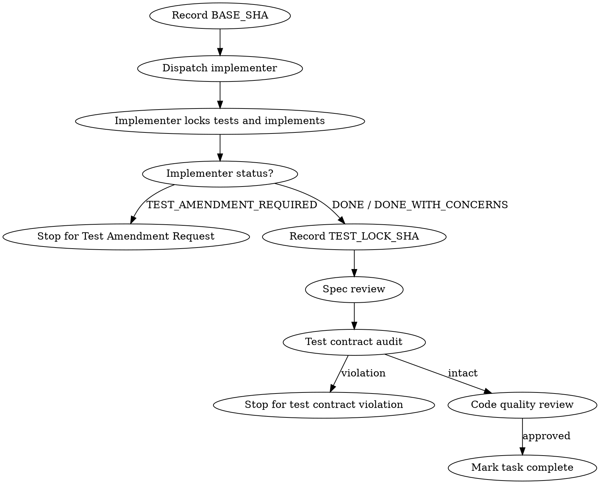

# Subagent-Driven Development

Execute an implementation plan by dispatching a fresh implementer subagent for each task, then reviewing the result through spec compliance, test contract, and code quality gates.

**Core principle:** fresh subagent per task + auditable contract gates = fast progress without silent contract drift.

**Auditable continuous execution:** Continue across tasks only while test contracts remain intact.

You MUST stop and escalate when:
- a locked test needs modification
- implementation changes a locked test file
- a test failure can only be resolved by changing expected behavior
- a new domain term appears that is not in the Glossary Contract
- a task requires production symbols absent from the skeleton
- reviewer detects test weakening

Do not ask "should I continue?" for normal progress. Do stop for contract or test-lock violations.

## When to Use

Use this when you have an implementation plan with mostly independent tasks and want to execute it in the current session. Use `superpowers:executing-plans` instead when subagents are unavailable or the plan must be executed inline.

## Process

For each task:
1. Record `BASE_SHA`.
2. Dispatch the implementer with the complete task text and context.
3. Require skeleton-first Contract-Driven TDD when the task introduces new production symbols.
4. Record `TEST_LOCK_SHA` when tests are locked.
5. Run spec compliance review.
6. Run test contract audit.
7. Run code quality review.
8. Mark the task complete only after all gates pass.



## Handling Implementer Status

Implementer subagents report one of five statuses:

**DONE:** Proceed to spec compliance review.

**DONE_WITH_CONCERNS:** Read the concerns before review. If concerns involve correctness, scope, glossary drift, or test-lock integrity, resolve them before proceeding.

**NEEDS_CONTEXT:** Provide the missing context and re-dispatch.

**BLOCKED:** Assess whether the blocker is missing context, task size, model capability, or a plan defect. Re-dispatch only after the blocker has been addressed.

**TEST_AMENDMENT_REQUIRED:** The implementer believes a locked test is wrong or impossible to satisfy without changing the test. Stop execution. Present the Test Amendment Request to the human partner. Do not continue until approved.

Never ignore an escalation or force the same model to retry without changing instructions or context.

## Prompt Templates

- `./implementer-prompt.md` - Dispatch implementer subagent
- `./spec-reviewer-prompt.md` - Dispatch spec compliance reviewer subagent
- `./test-contract-reviewer-prompt.md` - Dispatch test contract reviewer subagent
- `./code-quality-reviewer-prompt.md` - Dispatch code quality reviewer subagent

## Controller Responsibilities

Before dispatching an implementer:
- Provide the full task text; do not make the subagent read the plan file.
- Include the Behavior Contract and Glossary Contract for the task.
- Include the required file paths, test commands, skeleton expectations, and lock/audit steps.

After the implementer returns:
- Verify the status field.
- Stop immediately on `TEST_AMENDMENT_REQUIRED`.
- Capture `BASE_SHA`, `TEST_LOCK_SHA`, `HEAD_SHA`, and locked test files.
- Dispatch reviewers with those exact values.
- Do not move to the next task until spec review, test contract audit, and code quality review all pass.

## Test Contract Audit

The test contract audit checks whether the implementation passed by changing the contract rather than satisfying it.

Always inspect:

```bash
git diff --stat TEST_LOCK_SHA..HEAD -- <locked-test-files>
git diff TEST_LOCK_SHA..HEAD -- <locked-test-files>
git diff BASE_SHA..HEAD
```

Reject the task if locked tests were changed after lock without an approved Test Amendment Request. Assertion weakening, skipped tests, deleted tests, renamed tests that avoid execution, expected-value changes, and more permissive mocks/fakes are contract violations.

## Continuous Execution Rules

Do not pause for routine progress. Continue to the next task only when:
- implementer status is DONE or acceptable DONE_WITH_CONCERNS
- spec compliance review passed
- test contract audit passed
- code quality review passed
- locked test files were not modified after `TEST_LOCK_SHA`, or every change has explicit amendment approval

Stop when:
- a locked test needs to be changed
- a test file changed after `TEST_LOCK_SHA` without explicit amendment approval
- a RED test fails because symbols, imports, fixtures, mocks, or build targets are missing
- the task requires production symbols absent from the skeleton
- a reviewer detects test weakening

## Red Flags

Never:
- Start implementation on main/master branch without explicit user consent
- Skip spec compliance, test contract, or code quality review
- Proceed with unfixed reviewer issues
- Dispatch multiple implementation subagents in parallel
- Make subagents read the plan file instead of giving full task text
- Accept "close enough" on spec compliance
- Let implementer self-review replace independent review
- Start code quality review before spec compliance passes
- Move to the next task while any review has open issues
- Let implementer modify locked tests during implementation
- Accept a task report that changed tests after `TEST_LOCK_SHA` without amendment approval
- Treat test changes as normal implementation cleanup
- Move to the next task before auditing locked test files

## Integration

Required workflow skills:
- `superpowers:using-git-worktrees`
- `superpowers:writing-plans`
- `superpowers:requesting-code-review`
- `superpowers:finishing-a-development-branch`

Subagents should use `superpowers:test-driven-development` for Contract-Driven TDD.