# Test-Driven Development (TDD)

## Overview

Write the test first. Watch it fail. Write minimal code to pass.

**Core principle:** If you didn't watch the test fail for the right reason, you don't know if it tests the right thing.

**Violating the letter of the rules is violating the spirit of the rules.**

## When to Use

**Always:**
- New features
- Bug fixes
- Refactoring
- Behavior changes

**Exceptions (ask your human partner):**
- Throwaway prototypes
- Generated code
- Configuration files

Thinking "skip TDD just this once"? Stop. That's rationalization.

## The Iron Law

```
NO PRODUCTION CODE WITHOUT A FAILING TEST FIRST
```

Write code before the test? Delete it. Start over.

**No exceptions:**
- Don't keep it as "reference"
- Don't "adapt" it while writing tests
- Don't look at it
- Delete means delete

Implement fresh from tests. Period.

## Contract Skeleton Exception

A production interface skeleton MAY be created before the failing test when needed to make tests compile.

Allowed skeleton code:
- public types
- function/method signatures
- empty implementations
- explicit `NotImplemented` / `throw` / placeholder returns
- build registration needed for compilation

Forbidden skeleton code:
- real business logic
- behavior that could satisfy the test
- hidden state transitions
- opportunistic refactors

This is not implementation. It exists only so RED tests can compile and fail for behavioral reasons.

## Red-Green-Refactor

```dot
digraph tdd_cycle {
    rankdir=LR;
    skeleton [label="Skeleton\nCompile/import", shape=box, style=filled, fillcolor="#eeeeee"];
    red [label="RED\nWrite failing behavioral test", shape=box, style=filled, fillcolor="#ffcccc"];
    verify_red [label="Verify compiling RED\nfails correctly", shape=diamond];
    lock [label="Lock test", shape=box];
    green [label="GREEN\nProduction code only", shape=box, style=filled, fillcolor="#ccffcc"];
    verify_green [label="Verify passes\nAll green", shape=diamond];
    audit [label="Audit locked tests", shape=diamond];
    refactor [label="REFACTOR\nClean up", shape=box, style=filled, fillcolor="#ccccff"];
    next [label="Next", shape=ellipse];

    skeleton -> red;
    red -> verify_red;
    verify_red -> lock [label="yes"];
    verify_red -> red [label="wrong\nfailure"];
    lock -> green;
    green -> verify_green;
    verify_green -> audit [label="yes"];
    verify_green -> green [label="no"];
    audit -> refactor [label="tests intact"];
    audit -> green [label="fix production"];
    refactor -> verify_green [label="stay\ngreen"];
    verify_green -> next;
    next -> skeleton;
}
```



### RED - Write Failing Test

Write one minimal test showing what should happen.

<Good>
```typescript
test('retries failed operations 3 times', async () => {
  let attempts = 0;
  const operation = () => {
    attempts++;
    if (attempts < 3) throw new Error('fail');
    return 'success';
  };

  const result = await retryOperation(operation);

  expect(result).toBe('success');
  expect(attempts).toBe(3);
});
```
Clear name, tests real behavior, one thing
</Good>

<Bad>
```typescript
test('retry works', async () => {
  const mock = jest.fn()
    .mockRejectedValueOnce(new Error())
    .mockRejectedValueOnce(new Error())
    .mockResolvedValueOnce('success');
  await retryOperation(mock);
  expect(mock).toHaveBeenCalledTimes(3);
});
```
Vague name, tests mock not code
</Bad>

**Requirements:**
- One behavior
- Clear name
- Real code (no mocks unless unavoidable)

A valid RED test must:
- compile/import successfully
- use only existing production symbols from the skeleton
- fail because behavior is absent or wrong
- not fail because a class, function, fixture, mock, import, or build target is missing

## Test Review Manifest

Every new test must be accompanied by:

- Test name
- Behavior under test
- Given
- When
- Then
- Expected initial failure
- Production symbols used
- Test-only symbols used
- This test must not verify

Do not proceed to GREEN until the manifest is clear enough for a human to review without reading future implementation code.

### Verify RED - Watch It Fail

**MANDATORY. Never skip.**

```bash
npm test path/to/test.test.ts
```

Confirm:
- Test compiles/imports/builds successfully
- Test fails (not errors)
- Failure message is expected
- Fails because feature behavior is missing or wrong (not typos, missing symbols, imports, fixtures, mocks, or build targets)

**Test passes?** You're testing existing behavior. Fix test.

**Test errors?** Fix error, re-run until it fails correctly.

## Test Lock

After the RED test is accepted as a behavioral contract:

- Do not modify the locked test during implementation.
- Do not delete, skip, rename, weaken, or broaden assertions.
- Do not alter mocks/fakes to make production code pass.
- Do not modify tests and production code in the same implementation step.

If the test appears wrong, stop and produce a Test Amendment Request.

## Test Amendment Request

Required format:

- Test file:
- Test case:
- Current assertion:
- Problem:
- Evidence:
- Proposed change:
- Classification:
  - compile/fixture correction
  - API type adaptation
  - expected behavior change
  - scope change
  - assertion weakening
- Why this is not weakening the behavior:
- Requires approval: Yes

### GREEN - Minimal Code

Write simplest production code to pass the locked test.

<Good>
```typescript
async function retryOperation<T>(fn: () => Promise<T>): Promise<T> {
  for (let i = 0; i < 3; i++) {
    try {
      return await fn();
    } catch (e) {
      if (i === 2) throw e;
    }
  }
  throw new Error('unreachable');
}
```
Just enough to pass
</Good>

<Bad>
```typescript
async function retryOperation<T>(
  fn: () => Promise<T>,
  options?: {
    maxRetries?: number;
    backoff?: 'linear' | 'exponential';
    onRetry?: (attempt: number) => void;
  }
): Promise<T> {
  // YAGNI
}
```
Over-engineered
</Bad>

Don't add features, refactor other code, or "improve" beyond the test. Do not modify locked tests during GREEN.

### Verify GREEN - Watch It Pass

**MANDATORY.**

```bash
npm test path/to/test.test.ts
```

Confirm:
- Test passes
- Other tests still pass
- Output pristine (no errors, warnings)
- Locked test files were not modified after lock

**Test fails?** Fix code, not test.

**Other tests fail?** Fix now.

**Locked test needs change?** Stop and produce a Test Amendment Request.

### REFACTOR - Clean Up

After green only:
- Remove duplication
- Improve names
- Extract helpers

Keep tests green. Don't add behavior. Do not change locked test behavior without an approved Test Amendment Request.

### Repeat

Next failing test for next feature.

## Good Tests

| Quality | Good | Bad |
|---------|------|-----|
| **Minimal** | One thing. "and" in name? Split it. | `test('validates email and domain and whitespace')` |
| **Clear** | Name describes behavior | `test('test1')` |
| **Shows intent** | Demonstrates desired API | Obscures what code should do |
| **Auditable RED** | Compiles and fails because behavior is absent | Fails because symbol/import/build target is missing |

## Why Order Matters

**"I'll write tests after to verify it works"**

Tests written after code pass immediately. Passing immediately proves nothing:
- Might test wrong thing
- Might test implementation, not behavior
- Might miss edge cases you forgot
- You never saw it catch the bug

Test-first forces you to see the test fail, proving it actually tests something.

**"I'll let the test fail because the function is undefined"**

That is not a behavioral RED. A missing symbol proves only that the test cannot reach production behavior. Create a skeleton first, compile/import it, then write a test that fails because the behavior is not implemented.

**"I already manually tested all the edge cases"**

Manual testing is ad-hoc. You think you tested everything but:
- No record of what you tested
- Can't re-run when code changes
- Easy to forget cases under pressure
- "It worked when I tried it" ≠ comprehensive

Automated tests are systematic. They run the same way every time.

**"Deleting X hours of work is wasteful"**

Sunk cost fallacy. The time is already gone. Your choice now:
- Delete and rewrite with TDD (X more hours, high confidence)
- Keep it and add tests after (30 min, low confidence, likely bugs)

The "waste" is keeping code you can't trust. Working code without real tests is technical debt.

**"TDD is dogmatic, being pragmatic means adapting"**

TDD IS pragmatic:
- Finds bugs before commit (faster than debugging after)
- Prevents regressions (tests catch breaks immediately)
- Documents behavior (tests show how to use code)
- Enables refactoring (change freely, tests catch breaks)

"Pragmatic" shortcuts = debugging in production = slower.

**"Tests after achieve the same goals - it's spirit not ritual"**

No. Tests-after answer "What does this do?" Tests-first answer "What should this do?"

Tests-after are biased by your implementation. You test what you built, not what's required. You verify remembered edge cases, not discovered ones.

Tests-first force edge case discovery before implementing. Tests-after verify you remembered everything (you didn't).

30 minutes of tests after ≠ TDD. You get coverage, lose proof tests work.

## Common Rationalizations

| Excuse | Reality |
|--------|---------|
| "Too simple to test" | Simple code breaks. Test takes 30 seconds. |
| "I'll test after" | Tests passing immediately prove nothing. |
| "Tests after achieve same goals" | Tests-after = "what does this do?" Tests-first = "what should this do?" |
| "It can fail because the function is missing" | Missing symbol is not behavioral RED. Add a skeleton first. |
| "I'll fix the test during implementation" | Locked tests are contracts. Produce a Test Amendment Request. |
| "Already manually tested" | Ad-hoc ≠ systematic. No record, can't re-run. |
| "Deleting X hours is wasteful" | Sunk cost fallacy. Keeping unverified code is technical debt. |
| "Keep as reference, write tests first" | You'll adapt it. That's testing after. Delete means delete. |
| "Need to explore first" | Fine. Throw away exploration, start with TDD. |
| "Test hard = design unclear" | Listen to test. Hard to test = hard to use. |
| "TDD will slow me down" | TDD faster than debugging. Pragmatic = test-first. |
| "Manual test faster" | Manual doesn't prove edge cases. You'll re-test every change. |
| "Existing code has no tests" | You're improving it. Add tests for existing code. |

## Red Flags - STOP and Start Over

- Code before test, except allowed interface skeleton with no behavior
- Test after implementation
- Test passes immediately
- Can't explain why test failed
- RED test fails due to missing symbol/import/fixture/mock/build target
- Locked test changed during GREEN without a Test Amendment Request
- Tests added "later"
- Rationalizing "just this once"
- "I already manually tested it"
- "Tests after achieve the same purpose"
- "It's about spirit not ritual"
- "Keep as reference" or "adapt existing code"
- "Already spent X hours, deleting is wasteful"
- "TDD is dogmatic, I'm being pragmatic"
- "This is different because..."

**All of these mean: Delete code or stop for amendment. Start over with TDD if needed.**

## Example: Bug Fix

**Bug:** Empty email accepted

**Skeleton**
```typescript
function submitForm(data: FormData): { error?: string } {
  throw new Error('behavior not implemented');
}
```

**RED**
```typescript
test('rejects empty email', async () => {
  const result = await submitForm({ email: '' });
  expect(result.error).toBe('Email required');
});
```

**Test Review Manifest**
- Test name: rejects empty email
- Behavior under test: empty email is rejected
- Given: form data with an empty email
- When: submitForm validates the data
- Then: returns `Email required`
- Expected initial failure: behavior not implemented
- Production symbols used: submitForm
- Test-only symbols used: none
- This test must not verify: formatting or unrelated field validation

**Verify RED**
```bash
$ npm test
FAIL: behavior not implemented
```

**Lock test**
```bash
TEST_LOCK_SHA=$(git rev-parse HEAD)
```

**GREEN**
```typescript
function submitForm(data: FormData) {
  if (!data.email?.trim()) {
    return { error: 'Email required' };
  }
  // ...
}
```

**Verify GREEN**
```bash
$ npm test
PASS
```

**Audit test lock**
```bash
$ git diff --name-only TEST_LOCK_SHA..HEAD -- '*test*' 'tests/**'
```
Expected: no locked test files changed after TEST_LOCK_SHA.

**REFACTOR**
Extract validation for multiple fields if needed.

## Verification Checklist

Before marking work complete:

- [ ] Every new function/method has a test
- [ ] Any new production API used by tests existed in a skeleton before the test
- [ ] Watched each test fail before implementing
- [ ] RED tests compiled/imported before implementation
- [ ] Each test failed for expected reason (feature missing, not typo)
- [ ] RED tests failed for behavioral reasons, not missing symbols
- [ ] Test Review Manifest exists for every new test
- [ ] Wrote minimal code to pass each test
- [ ] Locked test files were not modified during GREEN
- [ ] Any test change after lock went through Test Amendment Request
- [ ] All tests pass
- [ ] Output pristine (no errors, warnings)
- [ ] Tests use real code (mocks only if unavoidable)
- [ ] Edge cases and errors covered

Can't check all boxes? You skipped TDD or broke the test contract. Start over or produce an amendment.

## When Stuck

| Problem | Solution |
|---------|----------|
| Don't know how to test | Write wished-for API, then create skeleton for that API. Write assertion first. Ask your human partner. |
| Test fails because symbol is missing | Add/confirm skeleton, compile/import, then re-run RED. |
| Test too complicated | Design too complicated. Simplify interface. |
| Must mock everything | Code too coupled. Use dependency injection. |
| Test setup huge | Extract helpers. Still complex? Simplify design. |
| Locked test seems wrong | Stop and write a Test Amendment Request. |

## Debugging Integration

Bug found? Write failing test reproducing it. Follow TDD cycle. Test proves fix and prevents regression.

Never fix bugs without a test.

## Testing Anti-Patterns

When adding mocks or test utilities, read @testing-anti-patterns.md to avoid common pitfalls:
- Testing mock behavior instead of real behavior
- Adding test-only methods to production classes
- Mocking without understanding dependencies

## Final Rule

```
Production behavior → test exists, compiled, failed behaviorally, and was locked first
Otherwise → not TDD
```

No exceptions without your human partner's permission.
